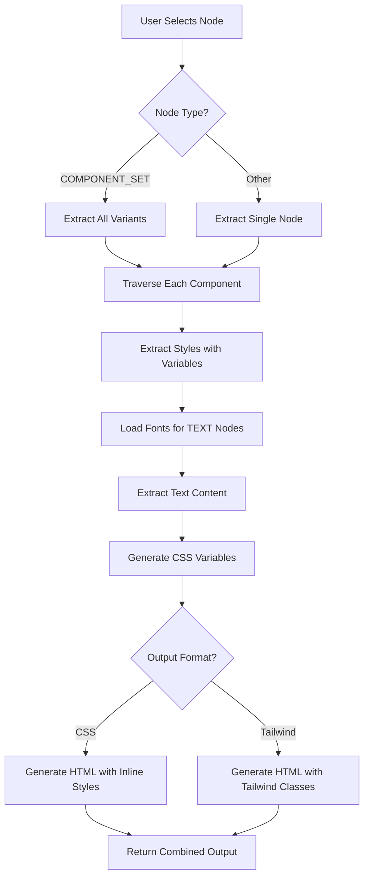

# DOM Extractor Tool Documentation

This document provides comprehensive technical documentation for the DOM Extractor Tool, which extracts complete DOM structures with styles from Figma components and generates production-ready code.

## Table of Contents

1. [Overview](#overview)
2. [Architecture](#architecture)
3. [Extraction Pipeline](#extraction-pipeline)
4. [Component Traversal](#component-traversal)
5. [Style Extraction](#style-extraction)
6. [Variable Resolution](#variable-resolution)
7. [Output Formats](#output-formats)
8. [Property Mappings](#property-mappings)
9. [Extending the Extractor](#extending-the-extractor)

---

## Overview

The DOM Extractor Tool converts Figma components into HTML with CSS or Tailwind classes. It extracts:

- Complete node hierarchies with parent-child relationships
- All visual styles (fills, strokes, effects, typography, layout)
- Figma variable bindings and resolves them to actual values
- Text content from TEXT nodes
- Component properties and variant definitions
- Data attributes for semantic HTML

### Key Features

- **Component Set Support**: Automatically extracts all variants when a COMPONENT_SET is selected
- **Variable Detection**: Resolves Figma variables for colors, spacing, typography, borders, and more
- **Dual Output Formats**: CSS with inline styles or Tailwind utility classes
- **Zero-Value Filtering**: Removes useless properties like `border-radius: 0px`
- **Font Loading**: Asynchronously loads fonts before text extraction
- **Intelligent Remapping**: Converts Figma design tokens to semantic Tailwind classes

---

## Architecture

### Two-Side Communication

The plugin uses a dual-process architecture:

```
┌─────────────────────┐         ┌──────────────────────┐
│    UI (React)       │◄───────►│   Plugin Code        │
│    iframe sandbox   │         │   Figma sandbox      │
└─────────────────────┘         └──────────────────────┘
                                          │
                                          ▼
                                ┌──────────────────────┐
                                │   Figma API          │
                                │   - Nodes            │
                                │   - Variables        │
                                │   - Styles           │
                                │   - Fonts            │
                                └──────────────────────┘
```

**Communication**: Uses `monorepo-networker` for type-safe message passing between UI and plugin code.

### File Structure

```
src/
├── plugin/
│   ├── extractors/
│   │   ├── componentTraverser.ts    # Node tree traversal
│   │   └── styleExtractor.ts        # Style extraction with variables
│   ├── plugin.network.ts            # Message handlers & orchestration
│   └── plugin.ts                    # Plugin entry point
├── common/
│   ├── cssGenerator.ts              # CSS property generation
│   ├── tailwindGenerator.ts         # Tailwind class generation
│   ├── domGenerator.ts              # HTML with inline styles (CSS format)
│   ├── tailwindDomGenerator.ts      # HTML with Tailwind classes
│   └── rawJsonGenerator.ts          # Raw JSON output
└── ui/
    └── components/
        └── OutputDisplay.tsx        # Display & copy functionality
```

---

## Extraction Pipeline

### Step-by-Step Process



### Handler: `getCode` (plugin.network.ts)

```typescript
/**
 * Main extraction handler
 * 
 * PROCESS:
 * 1. Get current selection from Figma
 * 2. Load all variable collections
 * 3. Handle COMPONENT_SET nodes (extract all children)
 * 4. For each node:
 *    a. Traverse node tree (componentTraverser)
 *    b. Extract styles with variables (styleExtractor)
 *    c. Load fonts for TEXT nodes
 *    d. Extract text content
 * 5. Generate output in requested format(s)
 * 6. Return MultiFormatExtractionResult
 */
```

---

## Component Traversal

### Purpose

Builds a hierarchical tree structure representing the Figma component, preserving all parent-child relationships and node metadata. **Does NOT extract styles** - that's done separately.

### Implementation: `componentTraverser.ts`

#### `traverseComponent(node: SceneNode): ExtractedNode`

```typescript
/**
 * Recursively traverses a Figma node tree
 * 
 * CREATES:
 * - ExtractedNode with id, name, type, annotations
 * - Recursively processes all children
 * 
 * NODE METADATA:
 * - id: Unique Figma node ID
 * - name: Node name from Figma layer
 * - type: FRAME, TEXT, COMPONENT, INSTANCE, etc.
 * - annotations: Comments/notes attached to nodes
 * - children: Array of child ExtractedNode objects
 * 
 * NOTE: The `styles` property is populated later by styleExtractor
 */
```

#### `extractAnnotations(node: SceneNode): string[]`

Extracts comments and notes attached to Figma nodes. Checks both `annotation.label` and `annotation.labelMarkdown`.

#### `traverseSelection(selection: readonly SceneNode[]): ExtractedNode[]`

Entry point for multi-node extraction. Creates separate tree structures for each selected node.

**Use Case**: When extracting COMPONENT_SET nodes, this function creates one tree per variant.

---

## Style Extraction

### Purpose

Extracts all visual properties from Figma nodes and resolves variable bindings to actual values.

### Implementation: `styleExtractor.ts`

#### Main Function: `extractStyles(node, variables): ExtractedStyles`

```typescript
/**
 * Extracts all style properties from a node
 * 
 * RETURNS:
 * {
 *   fills: Array of fill objects (colors, gradients, images)
 *   strokes: Object with stroke colors, width, style, alignment
 *   effects: Array of shadow and blur effects
 *   typography: Font properties and text styling
 *   layout: Dimensions, spacing, flex, layout properties
 *   positioning: X, Y coordinates, rotation
 *   opacity: Opacity value (0-1)
 *   visible: Visibility flag
 * }
 */
```

### Individual Extractors

#### `extractFills(node, variables)`

**Extracts**:
- Solid fills (with color and opacity)
- Gradient fills (linear, radial, angular)
- Image fills (with imageHash)

**Variable Resolution**:
- Checks `node.boundVariables.fills[fillIndex]` for color variables
- Resolves variable value from variable collection
- Falls back to raw color if no variable bound

#### `extractStrokes(node, variables)`

**Extracts**:
- Stroke colors (with opacity)
- Stroke weight (border width)
- Stroke alignment (INSIDE, OUTSIDE, CENTER)
- Stroke dash array (for dashed borders)

**Variable Resolution**:
- Checks `strokeTopWeight`, `strokeBottomWeight`, `strokeLeftWeight`, `strokeRightWeight`
- Usually all four are bound to the same variable
- Checks any of them to find the stroke weight variable

#### `extractEffects(node)`

**Extracts**:
- Drop shadows (offset, blur, spread, color)
- Inner shadows
- Layer blur
- Background blur

**Note**: Effects do NOT support Figma variables (as of current Figma API).

#### `extractTypography(node, variables)`

**Extracts**:
- Font size (with variable)
- Font family (with variable)
- Font weight (with variable)
- Line height (with variable)
- Letter spacing (with variable)
- Text decoration (underline, strikethrough)
- Text case (uppercase, lowercase, capitalize)
- Text alignment

**Variable Resolution**:
- Typography properties are often stored as **arrays** in `boundVariables`
- Example: `boundVariables.fontSize = [{ id: "VariableID:...", type: "VariableAlias" }]`
- The resolver extracts the first element from these arrays
- Checks multiple property names: `fontSize`, `font-size`, `size`

#### `extractLayout(node, variables)`

**Extracts**:
- Width, height (with variables)
- Padding (all sides, with variables)
- Gap / itemSpacing (with variable)
- Border radius (with variable, checks per-corner properties)
- Opacity (with variable)
- Layout mode (HORIZONTAL, VERTICAL, NONE)
- Layout sizing (FILL, HUG, FIXED)
- Layout grow (flex-grow equivalent)
- Alignment properties (primaryAxisAlignItems, counterAxisAlignItems)

**Special Handling for INSTANCE Nodes**:
- For border radius variables, checks both instance and mainComponent
- Instance may override mainComponent values

#### `extractPositioning(node)`

**Extracts**:
- X, Y coordinates
- Rotation angle

**Note**: Positioning does NOT support variables.

---

## Variable Resolution

### How Variables Work in Figma

Figma stores variable bindings separately from the actual property values:

```typescript
// Node properties
node.width = 100;

// Variable bindings
node.boundVariables.width = {
  id: "VariableID:123/abc",
  type: "VariableAlias"
};
```

### Resolution Process

```typescript
/**
 * 1. Check if node.boundVariables[property] exists
 * 2. Handle array-based bindings (extract first element)
 * 3. Get variable ID from VariableAlias object
 * 4. Lookup variable using figma.variables.getVariableById()
 * 5. Find the variable collection containing this variable
 * 6. Get the first mode ID from the collection
 * 7. Resolve value using variable.valuesByMode[modeId]
 * 8. Return { name, value, isVariable: true }
 */
```

### Property Name Mapping

Figma uses different property names in `boundVariables` than the node properties:

| Node Property | boundVariables Property(ies) |
|--------------|------------------------------|
| `cornerRadius` | `topLeftRadius`, `topRightRadius`, `bottomLeftRadius`, `bottomRightRadius` |
| `strokeWeight` | `strokeTopWeight`, `strokeBottomWeight`, `strokeLeftWeight`, `strokeRightWeight` |
| `fontSize` | `fontSize` (may be array) |
| `lineHeight` | `lineHeight`, `line-height`, `lineHeightUnit` (may be array) |
| `fills[0]` | `boundVariables.fills[0]` |
| `strokes[0]` | `boundVariables.strokes[0]` |

The extractor automatically checks these alternative property names.

### CSS Custom Property Generation

Variable names are converted to CSS custom properties:

```typescript
// Figma variable name → CSS custom property
"spacing/7"         → "--spacing-7"
"color/primary"     → "--color-primary"
"font/size/lg"      → "--font-size-lg"
```

Generated `:root` block:

```css
<style>
  :root {
    --spacing-7: 28px;
    --color-primary: #0066ff;
    --font-size-lg: 18px;
  }
</style>
```

---

## Output Formats

### CSS Format (domGenerator.ts)

Generates HTML with inline styles and CSS custom properties.

**Features**:
- Inline styles with `var()` references
- CSS variables defined in `:root` block
- Zero-value properties filtered out
- Data attributes for semantics

**Example Output**:

```html
<style>
  :root {
    --spacing-4: 16px;
    --color-primary: #0066ff;
  }
</style>

<div
  data-name="Button"
  data-type="component"
  style="padding: var(--spacing-4); background-color: var(--color-primary);"
>
  <p data-name="Label" data-type="text" style="color: #ffffff;">
    Click me
  </p>
</div>
```

### Tailwind Format (tailwindDomGenerator.ts + tailwindGenerator.ts)

Generates HTML with Tailwind utility classes.

**Features**:
- Semantic class mapping from Figma variables
- Layout classes (flex, grid, positioning)
- Arbitrary value fallbacks for unsupported values
- CSS variable definitions for Tailwind config

**Example Output**:

```html
<div className="button-root flex flex-row p-4 bg-fill-primary rounded-lg">
  <p className="label-root text-base text-white">
    Click me
  </p>
</div>

<!-- Variable Map for Tailwind Config -->
<style>
  :root {
    --fill-primary: #0066ff;
  }
</style>
```

**Tailwind Remapping**:
See [CSS_TO_TAILWIND_MAPPING.md](./CSS_TO_TAILWIND_MAPPING.md) for complete remapping rules.

### Raw JSON Format (rawJsonGenerator.ts)

Outputs the complete extracted node tree as formatted JSON for debugging or custom processing.

---

## Property Mappings

### Supported Node Types → HTML Elements

| Figma Type | HTML Element |
|-----------|-------------|
| FRAME | `<div>` |
| COMPONENT | `<div>` |
| INSTANCE | `<div>` |
| GROUP | `<div>` |
| TEXT | `<p>` |
| RECTANGLE | `<div>` |
| ELLIPSE | `<div>` |
| POLYGON | `<div>` |
| STAR | `<div>` |
| VECTOR | `<svg>` (placeholder) |

### Variable Property Mappings

Properties that support variable bindings:

**Layout**:
- `width`, `height`
- `paddingTop`, `paddingRight`, `paddingBottom`, `paddingLeft`
- `itemSpacing` (gap)
- `topLeftRadius`, `topRightRadius`, `bottomLeftRadius`, `bottomRightRadius`
- `opacity`

**Typography**:
- `fontSize`, `font-size`, `size`
- `lineHeight`, `line-height`, `lineHeightUnit`
- `letterSpacing`, `letter-spacing`, `letterSpacingUnit`
- `fontFamily`, `font-family`, `family`
- `fontWeight`, `font-weight`, `weight`

**Strokes**:
- `strokeTopWeight`, `strokeBottomWeight`, `strokeLeftWeight`, `strokeRightWeight`
- `strokes[0]`, `strokes[1]`, etc. (colors)

**Fills**:
- `fills[0]`, `fills[1]`, etc. (colors)

### Component Properties

The extractor also extracts component property definitions:

```typescript
interface ExtractedComponentProperty {
  name: string;
  type: "VARIANT" | "BOOLEAN" | "TEXT" | "INSTANCE_SWAP";
  defaultValue: string | boolean;
  variantOptions?: string[]; // For VARIANT type
}
```

**Sources**:
- COMPONENT_SET: `componentPropertyDefinitions`, `variantGroupProperties`
- COMPONENT: `componentPropertyDefinitions`, parses variant name
- INSTANCE: Gets definitions from `mainComponent`, parses `componentProperties`

**Usage**: Component properties are used by the CVA tool to auto-detect variant properties.

---

## Extending the Extractor

### Adding New Style Properties

To extract a new style property:

1. **Add to `ExtractedStyles` interface** in `styleExtractor.ts`
2. **Create extractor function** following the pattern:
   ```typescript
   function extractNewProperty(node: SceneNode, variables: readonly VariableCollection[]): any {
     // Check if property exists on node
     if (!("newProperty" in node)) return null;
     
     // Resolve variable if bound
     const value = resolveVariable(node, "newProperty", node.newProperty, variables);
     
     // Return extracted data
     return {
       value: value.value,
       variable: value.isVariable ? value.name : undefined,
     };
   }
   ```
3. **Call from `extractStyles()`**:
   ```typescript
   return {
     ...existingProperties,
     newProperty: extractNewProperty(node, variables),
   };
   ```
4. **Add to CSS/Tailwind generators** in `cssGenerator.ts` and `tailwindGenerator.ts`

### Adding New Variable Properties

To support variables for a new property:

1. **Identify the `boundVariables` property name** (may differ from node property name)
2. **Add to `resolveVariable()` calls** in the relevant extractor function
3. **Handle array bindings** if the property uses array format:
   ```typescript
   // For array-based bindings
   if (Array.isArray(variableBinding) && variableBinding.length > 0) {
     variableBinding = variableBinding[0];
   }
   ```
4. **Update variable name conversion** in CSS/Tailwind generators

### Adding New Output Formats

To add a new output format (e.g., React Native, SwiftUI):

1. **Create generator file** in `src/common/`:
   ```typescript
   // reactNativeGenerator.ts
   export function generateReactNative(extracted: ExtractedNode[]): string {
     // Transform extracted nodes to React Native code
     return code;
   }
   ```
2. **Add to `plugin.network.ts`** handler:
   ```typescript
   const reactNativeOutput = generateReactNative(extractedNodes);
   
   return {
     ...existingFormats,
     reactNative: {
       stylesheet: reactNativeOutput,
       variableMap: {},
     },
   };
   ```
3. **Update `MultiFormatExtractionResult`** type in `networkSides.ts`
4. **Add UI selector** in `OutputDisplay.tsx`

### Adding New Node Types

To support a new Figma node type:

1. **Add to `traverseComponent()`** - already handles all node types via generic approach
2. **Add style extraction** if the node type has unique properties
3. **Add HTML mapping** in DOM generators:
   ```typescript
   function getHTMLElement(nodeType: string): string {
     switch (nodeType) {
       case "NEW_TYPE":
         return "new-element";
       // ... other cases
     }
   }
   ```
4. **Update documentation** with new node type mapping

---

## Limitations and Known Issues

### Current Limitations

1. **Gradients**: Gradient fills are extracted but not converted to CSS variables or Tailwind classes
2. **Images**: Image fills are detected (imageHash included) but not exported as data URLs or files
3. **Complex Effects**: Some advanced effects (like advanced blur) may not be fully supported
4. **Font Loading**: Requires fonts to be available in Figma; fails if fonts are missing
5. **Variable Modes**: Currently uses the first mode from variable collections; doesn't support mode switching
6. **Text with Mixed Styles**: If a text node has mixed formatting (different styles within same text), uses first style
7. **Absolute Positioning**: Absolute positioning is extracted but not converted to CSS (would need parent context)
8. **Constraints**: Figma constraints are not converted to CSS positioning

### Font Loading

The plugin loads fonts asynchronously before extracting text content:

```typescript
async function loadNodeFonts(node: SceneNode): Promise<void> {
  if (node.type === "TEXT") {
    const fontName = node.fontName;
    if (fontName !== figma.mixed) {
      await figma.loadFontAsync(fontName);
    }
  }
  
  if ("children" in node) {
    for (const child of node.children) {
      await loadNodeFonts(child);
    }
  }
}
```

**Error Handling**: If font loading fails, text extraction may be incomplete.

---

## Debugging Tips

### Classes Not Extracting

1. **Check selection**: Ensure node is actually selected in Figma
2. **Check node type**: Some node types (like BOOLEAN_OPERATION) may not extract properly
3. **Check visibility**: Hidden nodes are extracted with `visible: false` flag

### Variables Not Resolving

1. **Check variable binding**: Verify variable is actually bound in Figma
2. **Check property name**: May need to check alternative property names (see [Property Name Mapping](#property-name-mapping))
3. **Check variable collection**: Ensure variable is in a local collection (remote libraries may not work)
4. **Check mode**: Variable may have different values per mode; extractor uses first mode

### Text Not Extracting

1. **Check font loading**: Verify fonts are available in Figma
2. **Check text node**: Must be actual TEXT node type
3. **Check mixed content**: Mixed styles may cause partial extraction

### Console Logging

Add debug logging in extraction functions:

```typescript
// In styleExtractor.ts
console.log("Extracting styles for:", node.name);
console.log("Bound variables:", node.boundVariables);
console.log("Resolved fills:", extractedFills);
```

---

## Performance Considerations

### Large Component Sets

When extracting COMPONENT_SET nodes with many variants:

- Each variant is traversed separately
- Fonts are loaded for each variant
- Memory usage scales with number of variants × node count

**Optimization**: Consider extracting individual components instead of entire set.

### Deep Node Hierarchies

Deeply nested components (>20 levels) may be slower to traverse.

**Why**: Recursive traversal + style extraction for each node.

### Many Variables

Files with hundreds of variables may slow down resolution.

**Why**: Must search through all collections to find each variable's collection and mode.

---

## Testing

### Manual Testing Checklist

- [ ] Simple component (single frame with text)
- [ ] Component with variables (colors, spacing, typography)
- [ ] Component set (multiple variants)
- [ ] Nested components (component instances within components)
- [ ] Complex layouts (auto-layout, absolute positioning)
- [ ] Various node types (rectangles, ellipses, vectors)
- [ ] Text with special characters and formatting
- [ ] Components with effects (shadows, blur)
- [ ] Components with strokes and borders

### Expected Output Validation

For each format:

1. **CSS Format**: Valid HTML, inline styles, CSS variables
2. **Tailwind Format**: Valid HTML, Tailwind classes, no invalid classes
3. **Raw JSON**: Valid JSON, complete node tree

---

## Contributing

When extending the extractor:

1. **Follow existing patterns** for consistency
2. **Add comments** explaining complex logic
3. **Handle errors gracefully** (try/catch, null checks)
4. **Test with various node types** and configurations
5. **Update documentation** for new features
6. **Add TypeScript types** for new data structures

---

## File Reference

| File | Purpose |
|------|---------|
| `componentTraverser.ts` | Node tree traversal, builds hierarchical structure |
| `styleExtractor.ts` | Style extraction with variable resolution |
| `plugin.network.ts` | Message handlers, extraction orchestration |
| `cssGenerator.ts` | CSS property generation from extracted styles |
| `tailwindGenerator.ts` | Tailwind class generation with remapping |
| `domGenerator.ts` | HTML generation with inline styles (CSS format) |
| `tailwindDomGenerator.ts` | HTML generation with Tailwind classes |
| `rawJsonGenerator.ts` | Raw JSON output for debugging |
| `CSS_TO_TAILWIND_MAPPING.md` | Complete Tailwind remapping documentation |

---

## Additional Resources

- [Figma Plugin API Documentation](https://www.figma.com/plugin-docs/)
- [Figma Variables Documentation](https://help.figma.com/hc/en-us/articles/15339657135383-Guide-to-variables-in-Figma)
- [Tailwind CSS Documentation](https://tailwindcss.com/docs)
- [CVA (Class Variance Authority)](https://cva.style/)

