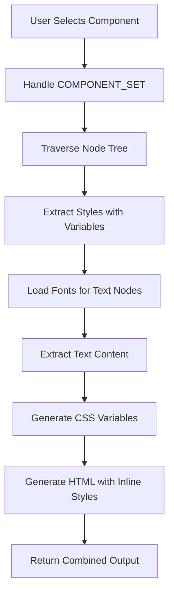

# Component DOM Extractor - Figma Plugin

A Figma plugin that extracts the complete DOM structure of selected components, including all visual and behavioral context. The plugin intelligently detects and uses Figma variables where applicable, falling back to raw values when variables aren't bound.

## Features

- **Complete Component Extraction**: Extracts full DOM structure with hierarchical node relationships
- **Variable Detection**: Automatically detects and uses Figma variables for colors, spacing, typography, borders, and more
- **Component Set Support**: Extracts all variants when a COMPONENT_SET is selected
- **Inline Styles**: Generates clean HTML with inline styles for easy integration
- **CSS Custom Properties**: Creates CSS variables for all detected Figma variables
- **Zero-Value Filtering**: Automatically filters out useless properties (e.g., `border-radius: 0px`, `padding: 0px`)
- **Text Content Extraction**: Preserves text content from TEXT nodes with proper font loading

## How It Works

### Architecture

The plugin uses a two-side architecture (plugin code and UI) that communicate via `monorepo-networker`:

```
┌─────────────┐         ┌──────────────┐
│  UI (React) │◄───────►│ Plugin Code  │
│   (iframe)  │         │  (main.js)   │
└─────────────┘         └──────────────┘
                              │
                              ▼
                    ┌─────────────────┐
                    │  Figma API      │
                    │  - Nodes        │
                    │  - Variables    │
                    │  - Styles       │
                    └─────────────────┘
```

### Extraction Pipeline

The extraction process follows these steps:



1. **Selection Handling**: If a COMPONENT_SET is selected, all component variants are extracted
2. **Tree Traversal**: Recursively traverses the node tree to build a hierarchical structure
3. **Style Extraction**: Extracts all style properties (fills, strokes, effects, typography, layout) with variable resolution
4. **Font Loading**: Loads fonts asynchronously for TEXT nodes before accessing text content
5. **CSS Generation**: Converts extracted styles to CSS, creating custom properties for variables
6. **HTML Generation**: Generates HTML with inline styles and data attributes

## What It Extracts

### Visual Properties

- **Fills**: Background colors (with opacity), gradients, images
- **Strokes**: Border colors, widths, alignment
- **Effects**: Drop shadows, inner shadows, blur effects
- **Typography**: Font family, size, weight, line height, letter spacing, text decoration, text case
- **Layout**: Width, height, padding, gap (itemSpacing), border radius, opacity
- **Positioning**: X, Y coordinates, rotation, constraints

### Structural Information

- **Node Hierarchy**: Complete parent-child relationships
- **Node Types**: FRAME, COMPONENT, INSTANCE, TEXT, RECTANGLE, etc.
- **Text Content**: Actual text from TEXT nodes
- **Data Attributes**: `data-name` and `data-type` for each element

### Variable Bindings

The plugin detects variables for:
- Colors (fills, strokes)
- Spacing (padding, gap)
- Typography (font size, weight, family, line height, letter spacing)
- Borders (width, radius)
- Layout (width, height)
- Opacity

## Variable Detection and Resolution

### How Variables Are Detected

Figma stores variable bindings in the `boundVariables` property of nodes. The plugin:

1. Checks `node.boundVariables[propertyName]` for each property
2. Handles array-based bindings (common for typography properties)
3. Resolves variable values from variable collections
4. Falls back to raw values when no variable is bound

### Property Name Mapping

Figma uses different property names in `boundVariables` than the node properties:

| Node Property | boundVariables Property |
|--------------|------------------------|
| `cornerRadius` | `topLeftRadius`, `topRightRadius`, `bottomLeftRadius`, `bottomRightRadius` |
| `strokeWeight` | `strokeTopWeight`, `strokeBottomWeight`, `strokeLeftWeight`, `strokeRightWeight` |
| `fontSize` | `fontSize` (may be array) |
| `fills[0]` | `boundVariables.fills[0]` |
| `strokes[0]` | `boundVariables.strokes[0]` |

The plugin automatically checks these alternative property names.

### Array-Based Bindings

Typography properties are often stored as arrays in `boundVariables`:

```javascript
boundVariables.fontSize = [{ id: "VariableID:...", type: "VariableAlias" }]
```

The plugin extracts the first element from these arrays.

### CSS Custom Property Generation

Figma variable names are converted to CSS custom properties:

- `"spacing/7"` → `"--spacing-7"`
- `"color/primary"` → `"--color-primary"`

The plugin generates a `:root` block with all CSS variables:

```css
<style>
  :root {
    --spacing-7: 28px;
    --color-primary: #0066ff;
  }
</style>
```

## Output Format

### HTML Structure

The output is clean HTML with:

- **Inline styles**: All styles applied directly to elements via `style` attribute
- **Data attributes**: `data-name` (first) and `data-type` for each element
- **Proper formatting**: Multi-line attributes with consistent indentation
- **Self-closing tags**: For elements without children

Example output:

```html
<style>
  :root {
    --spacing-4: 16px;
    --color-primary: #0066ff;
  }
</style>

<div
  data-name="Button"
  data-type="component"
  style="padding: var(--spacing-4); background-color: var(--color-primary);"
>
  <p
    data-name="Label"
    data-type="text"
    style="font-size: 16px; color: #ffffff;"
  >
    Click me
  </p>
</div>
```

### Filtered Properties

The plugin automatically filters out useless properties:
- `border-radius: 0px` or `border-radius: 0`
- `padding: 0px 0px 0px 0px` or `padding: 0`
- `gap: 0px` or `gap: 0`
- Individual padding properties with zero values

## Usage Instructions

### Installation

1. Clone this repository
2. Install dependencies:
   ```bash
   npm install
   ```

3. Build the plugin:
   ```bash
   npm run build
   ```

4. In Figma:
   - Right-click in a design file
   - Go to `Plugins > Development > Import plugin from manifest...`
   - Select `dist/manifest.json`

### Using the Plugin

1. **Select a component** (or multiple components) in Figma
2. **Open the plugin** from the plugins menu
3. **Click "Get code"** to extract the DOM structure
4. **Review the output** in the code snippet area
5. **Click "Copy"** to copy the generated HTML/CSS to your clipboard

### Component Set Handling

When you select a **COMPONENT_SET**, the plugin automatically extracts **all component variants** from the set. Each variant is generated as a separate HTML structure in the output.

### Copy Functionality

The copy button:
- Uses the modern Clipboard API when available
- Falls back to `document.execCommand('copy')` for compatibility
- Shows "Copied" feedback for 2 seconds after successful copy

## Technical Details

### Supported Node Types

- `FRAME` → `<div>`
- `COMPONENT` → `<div>`
- `INSTANCE` → `<div>`
- `GROUP` → `<div>`
- `TEXT` → `<p>`
- `RECTANGLE` → `<div>`
- `ELLIPSE` → `<div>`
- `POLYGON` → `<div>`
- `STAR` → `<div>`
- `VECTOR` → `<svg>`

### Variable Property Mappings

The plugin checks these property names when resolving variables:

**Layout:**
- `width`, `height`
- `paddingTop`, `paddingRight`, `paddingBottom`, `paddingLeft`
- `itemSpacing`
- `topLeftRadius`, `topRightRadius`, `bottomLeftRadius`, `bottomRightRadius`
- `opacity`

**Typography:**
- `fontSize`, `font-size`, `size`
- `lineHeight`, `line-height`, `lineHeightUnit`
- `letterSpacing`, `letter-spacing`, `letterSpacingUnit`
- `fontFamily`, `font-family`, `family`
- `fontWeight`, `font-weight`, `weight`

**Strokes:**
- `strokeTopWeight`, `strokeBottomWeight`, `strokeLeftWeight`, `strokeRightWeight`
- `strokes[0]`, `strokes[1]`, etc. (for stroke colors)

**Fills:**
- `fills[0]`, `fills[1]`, etc. (for fill colors)

### Limitations

- **Gradients**: Gradient fills are extracted but not converted to CSS variables
- **Images**: Image fills are detected but not exported (imageHash is included)
- **Complex Effects**: Some advanced effects may not be fully supported
- **Font Loading**: Requires fonts to be available in Figma for text extraction
- **Variable Modes**: Currently uses the first mode from variable collections

## Development

### Project Structure

```
src/
├── common/              # Shared code between plugin and UI
│   ├── cssGenerator.ts  # CSS generation with variable support
│   ├── domGenerator.ts  # HTML generation with inline styles
│   └── networkSides.ts  # Communication channel definitions
├── plugin/              # Plugin-side code (runs in Figma)
│   ├── extractors/
│   │   ├── componentTraverser.ts  # Node tree traversal
│   │   └── styleExtractor.ts      # Style extraction with variables
│   ├── plugin.network.ts           # Message handlers
│   └── plugin.ts                  # Plugin entry point
└── ui/                  # UI-side code (React app)
    ├── app.tsx          # Main UI component
    └── app.network.tsx  # UI communication setup
```

### Build Commands

- `npm run build` - Build for production
- `npm run dev` - Watch mode for development
- `npm run types` - Type check TypeScript

### Key Files

- **`src/plugin/extractors/styleExtractor.ts`**: Core style extraction logic with variable resolution
- **`src/common/cssGenerator.ts`**: Converts extracted styles to CSS with variable support
- **`src/common/domGenerator.ts`**: Generates HTML with inline styles and formatting
- **`src/plugin/plugin.network.ts`**: Main extraction handler and orchestration

## License

This project is based on the [figma-plugin-react-vite](https://github.com/iGoodie/figma-plugin-react-vite) boilerplate.

© 2024 - Licensed under [Attribution-ShareAlike 4.0 International](http://creativecommons.org/licenses/by-sa/4.0/)
