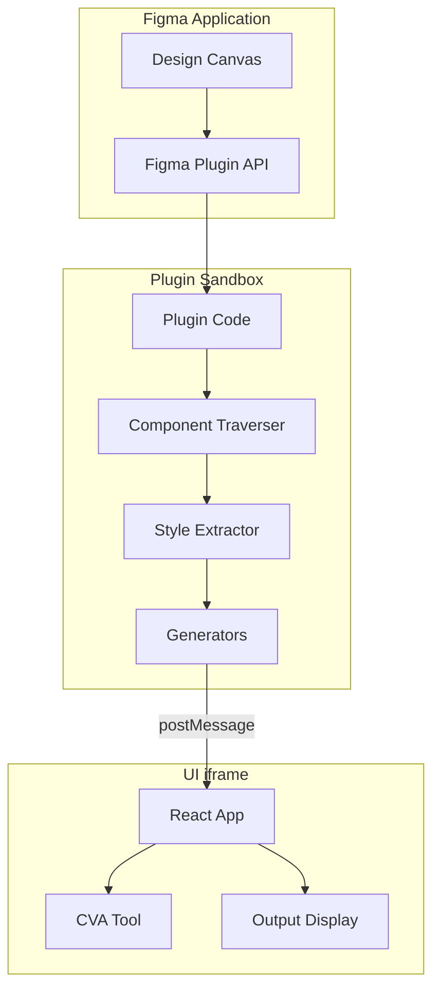
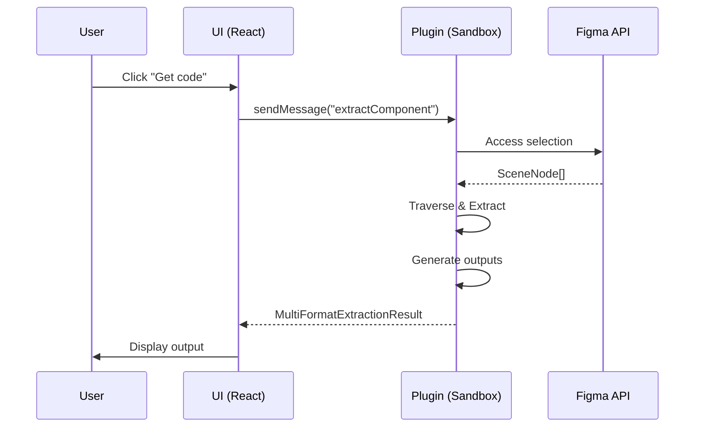
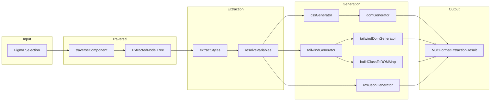
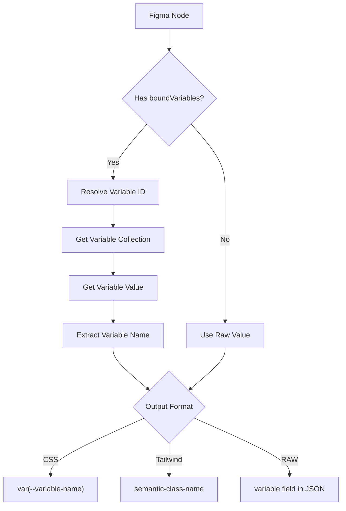
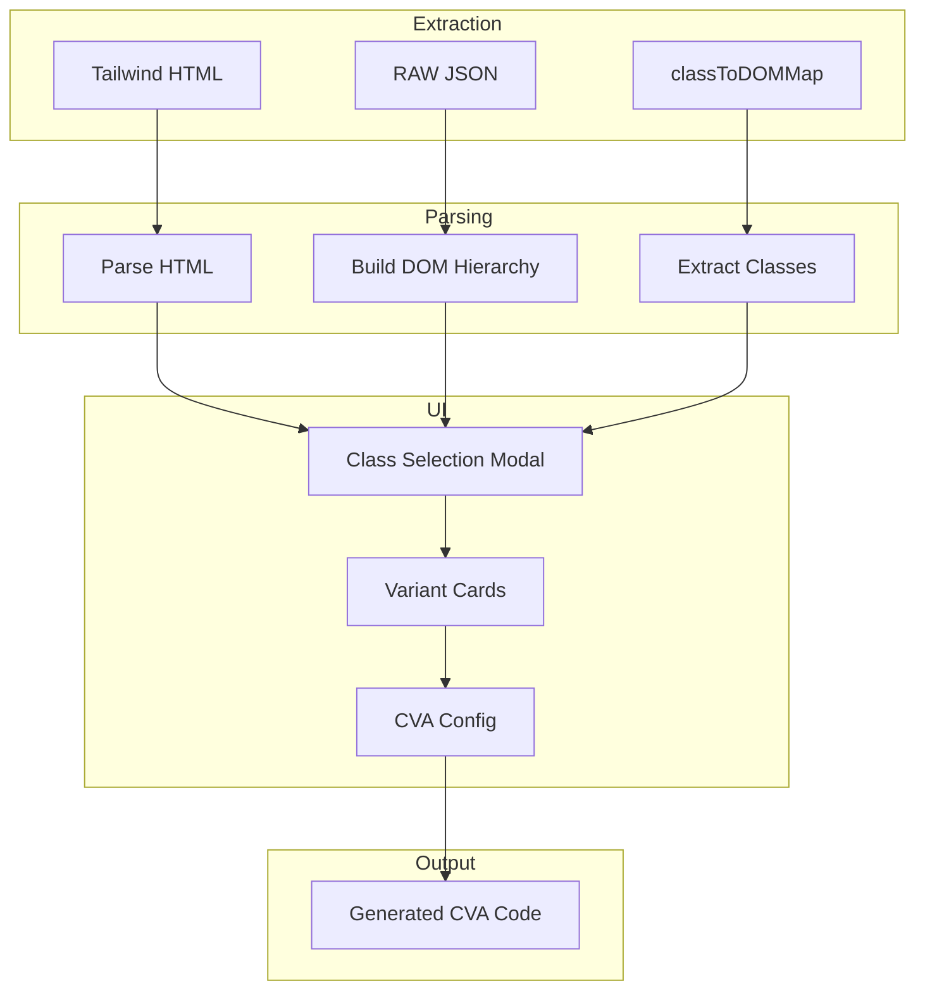
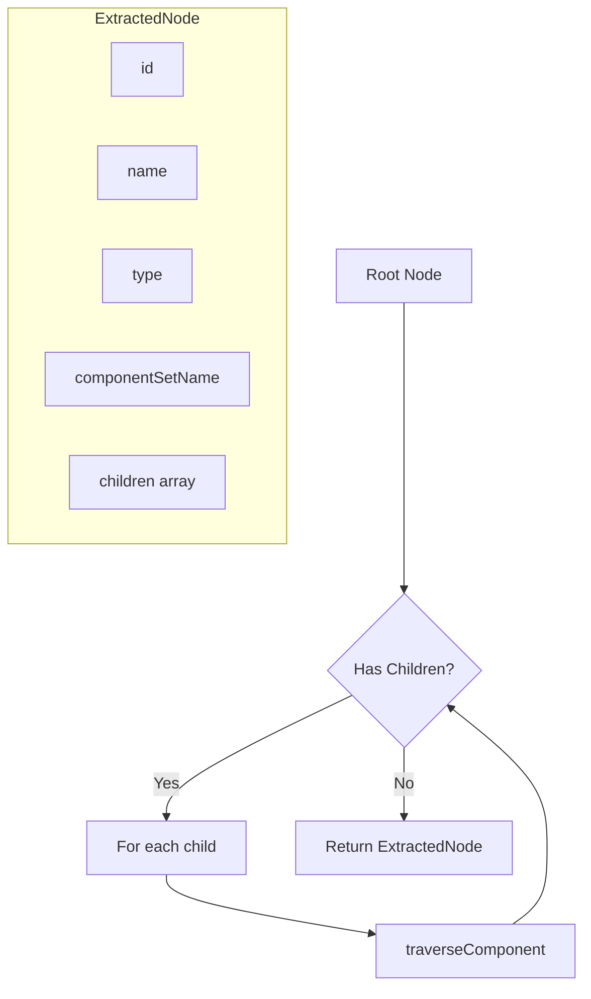
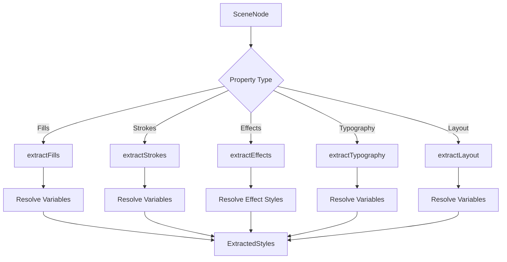
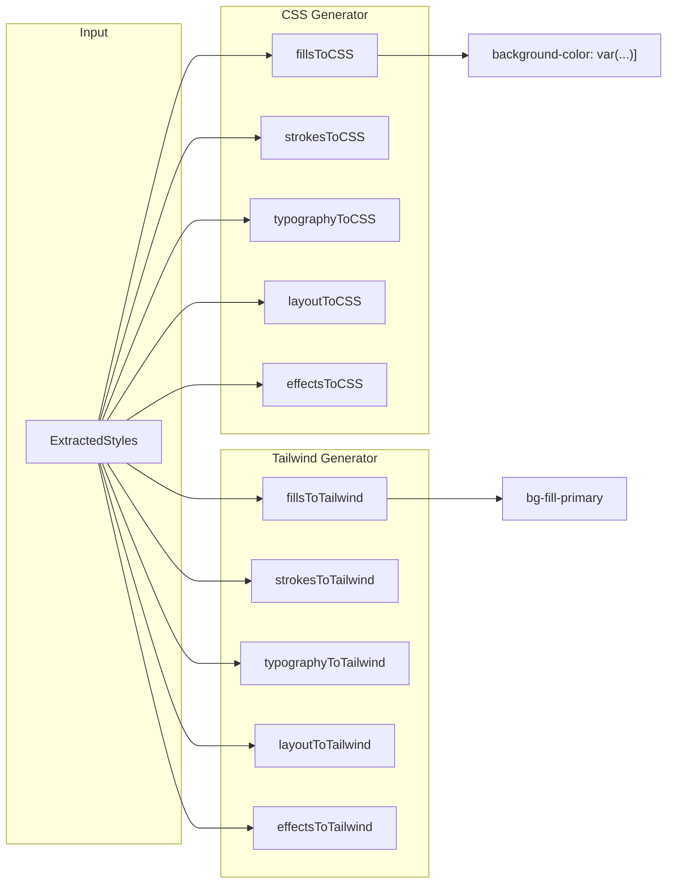
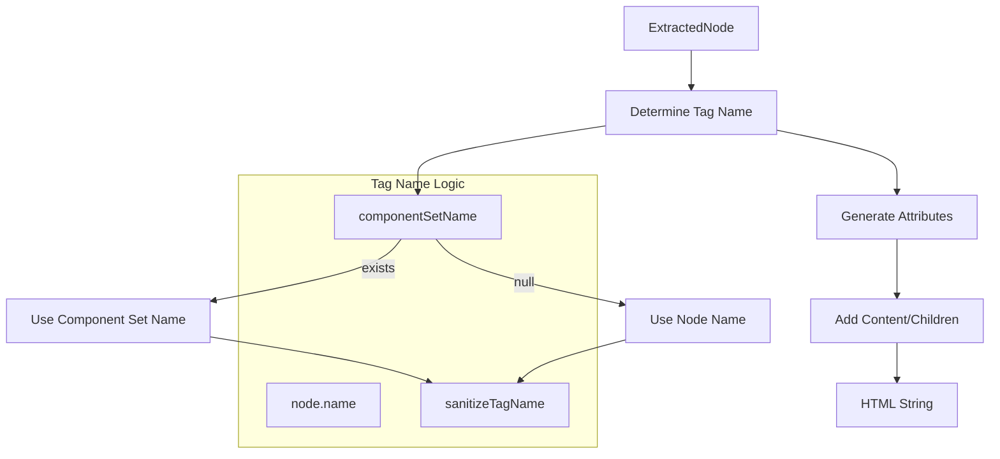

# Architecture

System architecture and design decisions for the Figma Design-to-Code Plugin.

---

## Table of Contents

1. [System Overview](#system-overview)
2. [Data Flow](#data-flow)
3. [Key Subsystems](#key-subsystems)
4. [Design Decisions](#design-decisions)
5. [Performance Considerations](#performance-considerations)

---

## System Overview

### High-Level Architecture



### Plugin-UI Split

The plugin runs in two separate JavaScript contexts:

| Context | Environment | Access | Purpose |
|---------|-------------|--------|---------|
| Plugin | Figma Sandbox | `figma` API, No DOM | Extract design data |
| UI | Browser iframe | DOM, React | User interface |

Communication happens via `postMessage`:



### Communication Layer

Uses `monorepo-networker` for type-safe messaging:

```typescript
// Define channels
const PLUGIN = NetworkSide.create<PluginMessages, UIMessages>("plugin");
const UI = NetworkSide.create<UIMessages, PluginMessages>("ui");

// Type-safe message handlers
PLUGIN_CHANNEL.registerMessageHandler("extractComponent", async (params) => {
  // TypeScript knows params type and return type
  return result;
});
```

---

## Data Flow

### End-to-End Extraction Flow



### Variable Resolution Flow



### CVA Mapping Flow



---

## Key Subsystems

### Component Traversal

`src/plugin/extractors/componentTraverser.ts`



**Responsibilities:**
- Build tree structure from Figma nodes
- Detect icon components
- Extract annotations
- Capture component set names for variants

### Style Extraction

`src/plugin/extractors/styleExtractor.ts`



**Variable Resolution Strategy:**
1. Check `node.boundVariables[property]`
2. Handle array bindings (typography)
3. Handle per-side bindings (corners, strokes)
4. Resolve via `figma.variables.getVariableByIdAsync()`

### CSS/Tailwind Generation



### DOM Generation



---

## Design Decisions

### RAW JSON as Single Source of Truth

**Decision:** Use RAW JSON data for DOM-to-class mapping in CVA tool.

**Rationale:**
- HTML output may be transformed (e.g., icon components)
- RAW preserves original Figma structure
- Consistent across all output formats
- Easier to maintain single mapping source

**Implementation:**
```typescript
// Plugin builds map from RAW data
const classToDOMMap = buildClassToDOMMap(extractedNodes, variables);

// UI uses map for filtering
const elementClasses = classToDOMMap[className] || [];
```

### Separate CSS and Tailwind Generators

**Decision:** Maintain separate generation pipelines for CSS and Tailwind.

**Rationale:**
- Different output requirements (properties vs classes)
- Different variable handling strategies
- Easier to extend independently
- Clearer code organization

**Trade-off:** Some duplication, but better maintainability.

### Component Set Name for Variant Tags

**Decision:** Use parent component set name as tag for variant components.

**Problem:**
```jsx
// Without: variant properties become unusable tags
<typecheckboxstatedefault className="...">

// With: parent name is used
<Checkbox className="...">
```

**Implementation:**
```typescript
// In traverser
if (node.type === "COMPONENT" && node.parent?.type === "COMPONENT_SET") {
  extracted.componentSetName = node.parent.name;
}

// In DOM generator
const tag = sanitizeTagName(node.name, node.componentSetName);
```

### Dot Preservation in Tailwind Output

**Decision:** Preserve dots in tag names for Tailwind/React, remove for CSS/HTML.

**Rationale:**
- React supports namespaced components (`<Icon.Close>`)
- HTML doesn't support dots in tag names
- Different target environments need different handling

**Implementation:**
```typescript
// Tailwind (React)
sanitizeForReact("Icon.Close") // → "Icon.Close"

// CSS (HTML)  
sanitizeForHTML("Icon.Close")  // → "IconClose"
```

### Zero-Value Filtering

**Decision:** Filter zero-value properties by default with opt-out.

**Rationale:**
- `rounded-[0px]`, `p-0` have no visual effect
- Reduces output clutter
- User can disable via "Skip Zeros" setting

**Filtered Patterns:**
- `rounded-[0px]`, `rounded-0`
- `p-0`, `m-0`, `gap-0`
- `border-0`

---

## Performance Considerations

### Memoization Strategy

**React UI:**
```typescript
// Expensive computations memoized
const categorizedClasses = useMemo(() => {
  return categorizeClasses(extractedClasses);
}, [extractedClasses]);

// Callbacks memoized to prevent re-renders
const handleToggle = useCallback((classId) => {
  toggleClass(classId);
}, [toggleClass]);
```

### Efficient Tree Traversal

**Plugin Side:**
```typescript
// Single pass traversal
async function traverseComponent(node: SceneNode): Promise<ExtractedNode> {
  // Extract node data
  const extracted = { id: node.id, name: node.name, ... };
  
  // Recursively process children
  if ("children" in node) {
    extracted.children = await Promise.all(
      node.children.map(child => traverseComponent(child))
    );
  }
  
  return extracted;
}
```

### Variable Collection Caching

```typescript
// Variables fetched once per extraction
const variables = await getAllVariables();

// Passed to all extraction functions
extractStyles(node, variables);
```

### Class-to-DOM Map Pre-computation

```typescript
// Built once in plugin
const classToDOMMap = buildClassToDOMMap(nodes, variables);

// Sent to UI with extraction result
return { ...result, classToDOMMap };

// UI uses map directly (no re-computation)
const elements = classToDOMMap[className];
```

---

## Related Documentation

- [DEVELOPER_GUIDE.md](./DEVELOPER_GUIDE.md) - Development setup and extending
- [API_REFERENCE.md](./API_REFERENCE.md) - Function and interface reference
- [USER_GUIDE.md](./USER_GUIDE.md) - End user documentation

